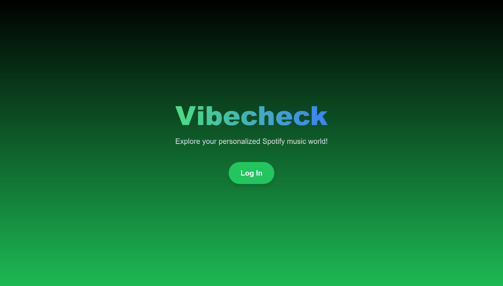
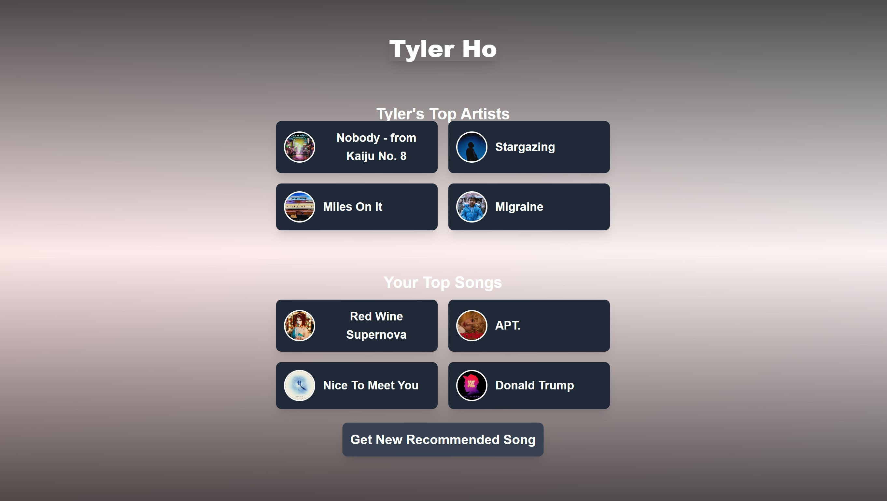

This is a [Next.js](https://nextjs.org/) project bootstrapped with [`create-next-app`](https://github.com/vercel/next.js/tree/canary/packages/create-next-app).

## Getting Started

First, create your own api spotify account [here](https://developer.spotify.com/documentation/web-api)
Add a .env file with the clinet secret and client id
Install npm
Run: npm install
Run: npm run dev
Open [http://localhost:3000](http://localhost:3000) with your browser to see the result.

## Technologies
Tailwind CSS
Next.js
Spotify API

